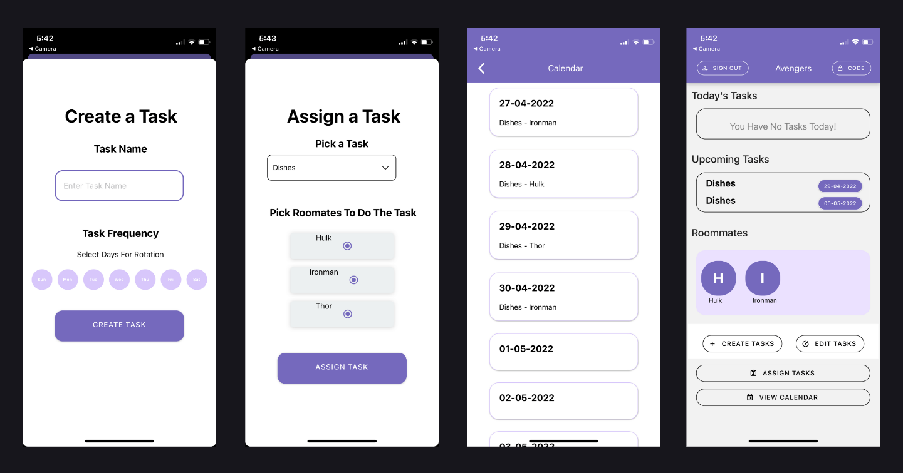

# RooMe

### Project Description
RooMe is a mobile app designed to help a set of roomates delegate chores and hold each other accountable.
### Features
  * Task Delegation and Frequency Assignment
  * Anonymous Push Notification Reminders
  * Comprehensive Calendar of All Tasks
### Screenshots + More Info
https://www.canva.com/design/DAFJikZabzM/-YP_VF3o5fb7EIeukWlKNg/view?utm_content=DAFJikZabzM&utm_campaign=designshare&utm_medium=link2&utm_source=sharebutton

### Tech Stack
 * Frontend
  * React Native (+ Typescript)
 * Backend
  * Firebase
